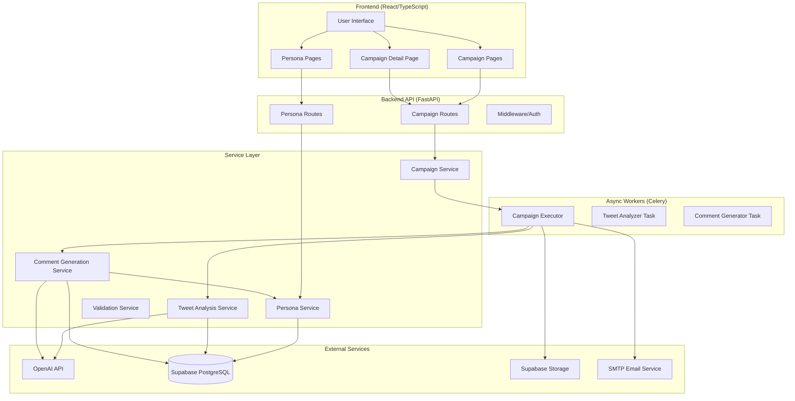

# Design: Sistema de Personas e Geração de Comentários com IA

## Overview

This design document specifies the technical architecture for implementing a comprehensive persona management and AI-powered comment generation system for the Twitter scraping SaaS platform. The system enables users to create multiple personas with distinct communication styles and automatically generates contextual, persona-aligned comments for collected tweets using OpenAI's GPT models.

### Key Capabilities

1. **Persona Management**: Full CRUD operations for personas with rich configuration (tone, principles, vocabulary, formatting rules)
2. **Campaign Integration**: Persona selection during campaign creation
3. **Tweet Analysis**: Multi-criteria scoring system (Lead Relevance, Tone of Voice, Insight Strength, Engagement Potential, Brand Safety)
4. **Comment Generation**: Persona-driven comment creation with validation
5. **Top 3 Selection**: Automatic identification of highest-scoring tweets
6. **Enhanced Deliverables**: Email and document with comments included
7. **Frontend Display**: Interactive comment viewing with copy-to-clipboard functionality

### Design Principles

- **Modularity**: Separate services for personas, analysis, and comment generation
- **Extensibility**: Easy to add new scoring criteria or persona fields
- **Reliability**: Validation, retry logic, and graceful error handling
- **Performance**: Async processing via Celery, caching where appropriate
- **User Experience**: Clear feedback, intuitive UI, seamless workflow integration

---

## Architecture

### System Components



### Data Flow

#### 1. Persona Creation Flow
```
User → Frontend Form → POST /api/personas → PersonaService → Validate → Save to DB → Return persona_id
```

#### 2. Campaign with Persona Flow
```
User → Campaign Form (select persona) → POST /api/campaigns → CampaignService → 
Enqueue Celery Task → Campaign Executor → Scrape Tweets → Analyze Tweets → 
Generate Comments → Update Email/Document → Complete
```

#### 3. Tweet Analysis & Comment Generation Flow
```
Campaign Executor → For each tweet:
  1. TweetAnalysisService.analyze(tweet) → OpenAI → Score (5 criteria) → Save to DB
  2. CommentGenerationService.generate(tweet, persona) → OpenAI → Comment → Validate → Save to DB
→ Select Top 3 by score → Update campaign
```

---

## Components and Interfaces

### 1. Database Schema

#### New Tables

##### `personas` Table
```sql
CREATE TABLE IF NOT EXISTS personas (
    id UUID PRIMARY KEY DEFAULT uuid_generate_v4(),
    name VARCHAR(255) NOT NULL,
    title VARCHAR(255) NOT NULL,
    description TEXT NOT NULL,
    tone_of_voice TEXT NOT NULL,
    principles TEXT[] NOT NULL,
    vocabulary_allowed TEXT[],
    vocabulary_forbidden TEXT[],
    formatting_rules TEXT[],
    language VARCHAR(10) NOT NULL DEFAULT 'en',
    system_prompt TEXT NOT NULL,
    is_default BOOLEAN DEFAULT FALSE,
    created_at TIMESTAMP WITH TIME ZONE DEFAULT NOW(),
    updated_at TIMESTAMP WITH TIME ZONE DEFAULT NOW()
);

CREATE INDEX idx_personas_is_default ON personas(is_default);
CREATE INDEX idx_personas_created_at ON personas(created_at DESC);

-- Trigger to auto-update updated_at
CREATE TRIGGER update_personas_updated_at
    BEFORE UPDATE ON personas
    FOR EACH ROW
    EXECUTE FUNCTION update_updated_at_column();

-- Ensure only one default persona
CREATE UNIQUE INDEX idx_personas_single_default 
    ON personas(is_default) 
    WHERE is_default = TRUE;
```

##### `tweet_analysis` Table
```sql
CREATE TABLE IF NOT EXISTS tweet_analysis (
    id UUID PRIMARY KEY DEFAULT uuid_generate_v4(),
    campaign_id UUID NOT NULL REFERENCES campaigns(id) ON DELETE CASCADE,
    tweet_id VARCHAR(255) NOT NULL,
    lead_relevance_score INTEGER NOT NULL CHECK (lead_relevance_score BETWEEN 0 AND 10),
    tone_of_voice_score INTEGER NOT NULL CHECK (tone_of_voice_score BETWEEN 0 AND 10),
    insight_strength_score INTEGER NOT NULL CHECK (insight_strength_score BETWEEN 0 AND 10),
    engagement_potential_score INTEGER NOT NULL CHECK (engagement_potential_score BETWEEN 0 AND 10),
    brand_safety_score INTEGER NOT NULL CHECK (brand_safety_score BETWEEN 0 AND 10),
    average_score DECIMAL(3,1) NOT NULL,
    verdict VARCHAR(20) NOT NULL CHECK (verdict IN ('APPROVED', 'REJECTED')),
    notes TEXT,
    is_top_3 BOOLEAN DEFAULT FALSE,
    created_at TIMESTAMP WITH TIME ZONE DEFAULT NOW()
);

CREATE INDEX idx_tweet_analysis_campaign_id ON tweet_analysis(campaign_id);
CREATE INDEX idx_tweet_analysis_tweet_id ON tweet_analysis(tweet_id);
CREATE INDEX idx_tweet_analysis_average_score ON tweet_analysis(average_score DESC);
CREATE INDEX idx_tweet_analysis_is_top_3 ON tweet_analysis(is_top_3);

-- Composite index for fetching top tweets
CREATE INDEX idx_tweet_analysis_campaign_score 
    ON tweet_analysis(campaign_id, average_score DESC);
```

##### `tweet_comments` Table
```sql
CREATE TABLE IF NOT EXISTS tweet_comments (
    id UUID PRIMARY KEY DEFAULT uuid_generate_v4(),
    campaign_id UUID NOT NULL REFERENCES campaigns(id) ON DELETE CASCADE,
    tweet_id VARCHAR(255) NOT NULL,
    persona_id UUID NOT NULL REFERENCES personas(id) ON DELETE RESTRICT,
    comment_text TEXT NOT NULL,
    char_count INTEGER NOT NULL,
    generation_attempt INTEGER DEFAULT 1,
    validation_status VARCHAR(20) NOT NULL CHECK (validation_status IN ('valid', 'failed', 'regenerated')),
    validation_errors TEXT[],
    created_at TIMESTAMP WITH TIME ZONE DEFAULT NOW()
);

CREATE INDEX idx_tweet_comments_campaign_id ON tweet_comments(campaign_id);
CREATE INDEX idx_tweet_comments_tweet_id ON tweet_comments(tweet_id);
CREATE INDEX idx_tweet_comments_persona_id ON tweet_comments(persona_id);

-- Composite index for fetching comments by campaign
CREATE INDEX idx_tweet_comments_campaign_tweet 
    ON tweet_comments(campaign_id, tweet_id);
```

#### Modified Tables

##### `campaigns` Table (Add persona_id)
```sql
ALTER TABLE campaigns 
ADD COLUMN persona_id UUID REFERENCES personas(id) ON DELETE SET NULL;

CREATE INDEX idx_campaigns_persona_id ON campaigns(persona_id);
```

---

### 2. Backend Models

#### Persona Models

```python
# src/models/persona.py

from pydantic import BaseModel, field_validator
from typing import Optional, List
from datetime import datetime
from uuid import UUID

class PersonaCreateDTO(BaseModel):
    """Persona creation data transfer object."""
    
    name: str
    title: str
    description: str
    tone_of_voice: str
    principles: List[str]
    vocabulary_allowed: Optional[List[str]] = None
    vocabulary_forbidden: Optional[List[str]] = None
    formatting_rules: Optional[List[str]] = None
    language: str = "en"
    system_prompt: str
    is_default: bool = False

    @field_validator("name", "title", "description", "tone_of_voice", "system_prompt")
    @classmethod
    def not_empty(cls, v: str) -> str:
        if not v or not v.strip():
            raise ValueError("Field cannot be empty")
        return v.strip()

    @field_validator("principles")
    @classmethod
    def principles_not_empty(cls, v: List[str]) -> List[str]:
        if not v or len(v) == 0:
            raise ValueError("At least one principle is required")
        return [p.strip() for p in v if p.strip()]

class PersonaUpdateDTO(BaseModel):
    """Persona update data transfer object."""
    
    name: Optional[str] = None
    title: Optional[str] = None
    description: Optional[str] = None
    tone_of_voice: Optional[str] = None
    principles: Optional[List[str]] = None
    vocabulary_allowed: Optional[List[str]] = None
    vocabulary_forbidden: Optional[List[str]] = None
    formatting_rules: Optional[List[str]] = None
    language: Optional[str] = None
    system_prompt: Optional[str] = None
    is_default: Optional[bool] = None

class Persona(BaseModel):
    """Full persona record."""
    
    id: UUID
    name: str
    title: str
    description: str
    tone_of_voice: str
    principles: List[str]
    vocabulary_allowed: Optional[List[str]] = None
    vocabulary_forbidden: Optional[List[str]] = None
    formatting_rules: Optional[List[str]] = None
    language: str
    system_prompt: str
    is_default: bool
    created_at: datetime
    updated_at: datetime
```

#### Tweet Analysis Models

```python
# src/models/tweet_analysis.py

from pydantic import BaseModel, field_validator
from typing import Optional
from datetime import datetime
from uuid import UUID
from enum import Enum

class Verdict(str, Enum):
    """Analysis verdict enumeration."""
    APPROVED = "APPROVED"
    REJECTED = "REJECTED"

class TweetAnalysisScores(BaseModel):
    """Individual scoring criteria."""
    
    lead_relevance: int
    tone_of_voice: int
    insight_strength: int
    engagement_potential: int
    brand_safety: int

    @field_validator("lead_relevance", "tone_of_voice", "insight_strength", 
                     "engagement_potential", "brand_safety")
    @classmethod
    def score_range(cls, v: int) -> int:
        if not 0 <= v <= 10:
            raise ValueError("Score must be between 0 and 10")
        return v

class TweetAnalysis(BaseModel):
    """Complete tweet analysis record."""
    
    id: UUID
    campaign_id: UUID
    tweet_id: str
    lead_relevance_score: int
    tone_of_voice_score: int
    insight_strength_score: int
    engagement_potential_score: int
    brand_safety_score: int
    average_score: float
    verdict: Verdict
    notes: Optional[str] = None
    is_top_3: bool = False
    created_at: datetime

class TweetAnalysisResult(BaseModel):
    """Analysis result from OpenAI."""
    
    scores: TweetAnalysisScores
    notes: str
    
    def calculate_average(self) -> float:
        """Calculate average score."""
        total = (
            self.scores.lead_relevance +
            self.scores.tone_of_voice +
            self.scores.insight_strength +
            self.scores.engagement_potential +
            self.scores.brand_safety
        )
        return round(total / 5, 1)
    
    def get_verdict(self) -> Verdict:
        """Determine verdict based on average score."""
        return Verdict.APPROVED if self.calculate_average() >= 8.0 else Verdict.REJECTED
```

#### Tweet Comment Models

```python
# src/models/tweet_comment.py

from pydantic import BaseModel, field_validator
from typing import Optional, List
from datetime import datetime
from uuid import UUID
from enum import Enum

class ValidationStatus(str, Enum):
    """Comment validation status."""
    VALID = "valid"
    FAILED = "failed"
    REGENERATED = "regenerated"

class TweetComment(BaseModel):
    """Tweet comment record."""
    
    id: UUID
    campaign_id: UUID
    tweet_id: str
    persona_id: UUID
    comment_text: str
    char_count: int
    generation_attempt: int
    validation_status: ValidationStatus
    validation_errors: Optional[List[str]] = None
    created_at: datetime

class CommentGenerationRequest(BaseModel):
    """Request to generate a comment."""
    
    tweet_text: str
    tweet_author: str
    persona_id: UUID

class CommentValidationResult(BaseModel):
    """Result of comment validation."""
    
    is_valid: bool
    errors: List[str] = []
    char_count: int
```

---

### 3. API Endpoints

#### Persona Endpoints

```python
# src/api/routes/personas.py

@router.post("/personas", status_code=201)
async def create_persona(data: PersonaCreateDTO) -> dict:
    """
    Create a new persona.
    
    Returns: {"persona_id": "uuid"}
    """
    pass

@router.get("/personas")
async def list_personas(
    page: int = 1,
    limit: int = 20
) -> PaginatedResponse[Persona]:
    """
    List all personas (paginated).
    
    Returns: Paginated list of personas
    """
    pass

@router.get("/personas/{persona_id}")
async def get_persona(persona_id: str) -> Persona:
    """
    Get persona details.
    
    Returns: Full persona record
    Raises: 404 if not found
    """
    pass

@router.put("/personas/{persona_id}")
async def update_persona(
    persona_id: str,
    data: PersonaUpdateDTO
) -> Persona:
    """
    Update persona.
    
    Returns: Updated persona record
    Raises: 404 if not found
    """
    pass

@router.delete("/personas/{persona_id}", status_code=204)
async def delete_persona(persona_id: str) -> None:
    """
    Delete persona.
    
    Raises: 404 if not found
    Raises: 400 if persona is in use by campaigns
    """
    pass

@router.get("/personas/default")
async def get_default_persona() -> Persona:
    """
    Get the default persona.
    
    Returns: Default persona record
    Raises: 404 if no default exists
    """
    pass
```

#### Campaign Endpoints (Modified)

```python
# Modify existing CampaignCreateDTO to include persona_id

class CampaignCreateDTO(BaseModel):
    # ... existing fields ...
    persona_id: Optional[str] = None  # New field
```

#### Tweet Analysis Endpoints

```python
# src/api/routes/tweet_analysis.py

@router.get("/campaigns/{campaign_id}/analysis")
async def get_campaign_analysis(
    campaign_id: str
) -> List[TweetAnalysis]:
    """
    Get all tweet analyses for a campaign.
    
    Returns: List of tweet analyses ordered by score (desc)
    """
    pass

@router.get("/campaigns/{campaign_id}/top-tweets")
async def get_top_tweets(
    campaign_id: str,
    limit: int = 3
) -> List[dict]:
    """
    Get top N tweets with analysis and comments.
    
    Returns: List of tweets with embedded analysis and comments
    """
    pass
```

#### Tweet Comment Endpoints

```python
# src/api/routes/tweet_comments.py

@router.get("/campaigns/{campaign_id}/comments")
async def get_campaign_comments(
    campaign_id: str
) -> List[TweetComment]:
    """
    Get all comments for a campaign.
    
    Returns: List of tweet comments
    """
    pass

@router.get("/tweets/{tweet_id}/comment")
async def get_tweet_comment(
    campaign_id: str,
    tweet_id: str
) -> TweetComment:
    """
    Get comment for a specific tweet.
    
    Returns: Tweet comment
    Raises: 404 if not found
    """
    pass

@router.post("/tweets/{tweet_id}/regenerate-comment")
async def regenerate_comment(
    campaign_id: str,
    tweet_id: str,
    persona_id: Optional[str] = None
) -> TweetComment:
    """
    Regenerate comment for a tweet (optionally with different persona).
    
    Returns: New tweet comment
    """
    pass
```

---

### 4. Service Layer

#### PersonaService

```python
# src/services/persona_service.py

class PersonaService:
    """Business logic for persona management."""
    
    def __init__(self, repo: PersonaRepository, validator: PersonaValidator):
        self._repo = repo
        self._validator = validator
    
    def create_persona(self, data: PersonaCreateDTO) -> str:
        """
        Create a new persona.
        
        - Validate input
        - If is_default=True, unset other defaults
        - Save to database
        - Return persona_id
        """
        pass
    
    def get_persona(self, persona_id: str) -> Persona:
        """Get persona by ID."""
        pass
    
    def list_personas(self, page: int, limit: int) -> PaginatedResponse[Persona]:
        """List personas with pagination."""
        pass
    
    def update_persona(self, persona_id: str, data: PersonaUpdateDTO) -> Persona:
        """Update persona."""
        pass
    
    def delete_persona(self, persona_id: str) -> None:
        """
        Delete persona.
        
        - Check if persona is in use by campaigns
        - If in use, raise error
        - Delete from database
        """
        pass
    
    def get_default_persona(self) -> Persona:
        """Get the default persona."""
        pass
    
    def ensure_default_persona_exists(self) -> Persona:
        """
        Ensure a default persona exists.
        
        If no default exists, create "Strategic Partner" persona.
        """
        pass
```

#### TweetAnalysisService

```python
# src/services/tweet_analysis_service.py

class TweetAnalysisService:
    """Service for analyzing tweets using OpenAI."""
    
    def __init__(self, openai_client: OpenAI, repo: TweetAnalysisRepository):
        self._client = openai_client
        self._repo = repo
    
    def analyze_tweet(self, tweet: Tweet, campaign_id: str) -> TweetAnalysis:
        """
        Analyze a single tweet.
        
        1. Build analysis prompt with scoring criteria
        2. Call OpenAI with structured output (JSON schema)
        3. Parse response into TweetAnalysisResult
        4. Calculate average score and verdict
        5. Save to database
        6. Return TweetAnalysis
        """
        pass
    
    def analyze_tweets_batch(
        self, 
        tweets: List[Tweet], 
        campaign_id: str
    ) -> List[TweetAnalysis]:
        """
        Analyze multiple tweets.
        
        Process in parallel (asyncio) for performance.
        """
        pass
    
    def mark_top_tweets(self, campaign_id: str, top_n: int = 3) -> List[TweetAnalysis]:
        """
        Mark top N tweets by score.
        
        1. Query all analyses for campaign
        2. Sort by average_score DESC
        3. Take top N
        4. Update is_top_3 = TRUE
        5. Return top analyses
        """
        pass
    
    def _build_analysis_prompt(self, tweet: Tweet) -> str:
        """
        Build the analysis prompt.
        
        Include:
        - Tweet text
        - Author
        - Engagement metrics
        - Scoring criteria definitions
        """
        pass
    
    def _get_analysis_schema(self) -> dict:
        """
        Return JSON schema for structured output.
        
        Schema enforces:
        - scores object with 5 integer fields (0-10)
        - notes string
        """
        pass
```

#### CommentGenerationService

```python
# src/services/comment_generation_service.py

class CommentGenerationService:
    """Service for generating persona-based comments."""
    
    MAX_ATTEMPTS = 3
    MAX_CHARS = 280
    
    def __init__(
        self, 
        openai_client: OpenAI,
        persona_service: PersonaService,
        repo: TweetCommentRepository,
        validator: CommentValidator
    ):
        self._client = openai_client
        self._persona_service = persona_service
        self._repo = repo
        self._validator = validator
    
    def generate_comment(
        self, 
        tweet: Tweet, 
        persona_id: str,
        campaign_id: str
    ) -> TweetComment:
        """
        Generate a comment for a tweet using a persona.
        
        1. Fetch persona
        2. Build generation prompt
        3. Call OpenAI
        4. Validate comment
        5. If invalid and attempts < MAX_ATTEMPTS, retry
        6. Save to database
        7. Return TweetComment
        """
        pass
    
    def generate_comments_batch(
        self,
        tweets: List[Tweet],
        persona_id: str,
        campaign_id: str
    ) -> List[TweetComment]:
        """
        Generate comments for multiple tweets.
        
        Process in parallel (asyncio) for performance.
        """
        pass
    
    def regenerate_comment(
        self,
        tweet: Tweet,
        persona_id: str,
        campaign_id: str
    ) -> TweetComment:
        """
        Regenerate a comment (user-triggered).
        
        Mark previous comment as 'regenerated'.
        """
        pass
    
    def _build_generation_prompt(self, tweet: Tweet, persona: Persona) -> str:
        """
        Build the comment generation prompt.
        
        Include:
        - Tweet text and author
        - Persona system prompt
        - Formatting requirements
        - Example structure
        """
        pass
    
    def _validate_and_retry(
        self,
        comment_text: str,
        persona: Persona,
        tweet: Tweet,
        attempt: int
    ) -> tuple[str, ValidationStatus, List[str]]:
        """
        Validate comment and retry if needed.
        
        Returns: (final_comment, status, errors)
        """
        pass
```

#### CommentValidator

```python
# src/services/comment_validator.py

class CommentValidator:
    """Validates generated comments against persona rules."""
    
    def validate(
        self, 
        comment: str, 
        persona: Persona,
        tweet_author: str
    ) -> CommentValidationResult:
        """
        Validate a comment.
        
        Checks:
        1. Length <= 280 characters
        2. Contains @username
        3. No forbidden vocabulary
        4. Follows formatting rules (e.g., no emojis)
        5. Language matches persona
        """
        errors = []
        
        # Check length
        if len(comment) > 280:
            errors.append(f"Comment exceeds 280 characters ({len(comment)})")
        
        # Check @username
        if f"@{tweet_author}" not in comment:
            errors.append(f"Comment must mention @{tweet_author}")
        
        # Check forbidden vocabulary
        if persona.vocabulary_forbidden:
            for word in persona.vocabulary_forbidden:
                if word.lower() in comment.lower():
                    errors.append(f"Comment contains forbidden word: {word}")
        
        # Check formatting rules
        if persona.formatting_rules:
            for rule in persona.formatting_rules:
                if "no emojis" in rule.lower():
                    if self._contains_emoji(comment):
                        errors.append("Comment contains emojis (forbidden)")
                if "no links" in rule.lower():
                    if "http" in comment.lower():
                        errors.append("Comment contains links (forbidden)")
        
        return CommentValidationResult(
            is_valid=len(errors) == 0,
            errors=errors,
            char_count=len(comment)
        )
    
    def _contains_emoji(self, text: str) -> bool:
        """Check if text contains emoji characters."""
        # Implementation using emoji library or regex
        pass
```

---

## Data Models

### Persona Data Model

```typescript
// frontend/src/types/persona.ts

export interface Persona {
  id: string
  name: string
  title: string
  description: string
  tone_of_voice: string
  principles: string[]
  vocabulary_allowed?: string[]
  vocabulary_forbidden?: string[]
  formatting_rules?: string[]
  language: string
  system_prompt: string
  is_default: boolean
  created_at: string
  updated_at: string
}

export interface PersonaCreateDTO {
  name: string
  title: string
  description: string
  tone_of_voice: string
  principles: string[]
  vocabulary_allowed?: string[]
  vocabulary_forbidden?: string[]
  formatting_rules?: string[]
  language?: string
  system_prompt: string
  is_default?: boolean
}
```

### Tweet Analysis Data Model

```typescript
// frontend/src/types/analysis.ts

export interface TweetAnalysis {
  id: string
  campaign_id: string
  tweet_id: string
  lead_relevance_score: number
  tone_of_voice_score: number
  insight_strength_score: number
  engagement_potential_score: number
  brand_safety_score: number
  average_score: number
  verdict: 'APPROVED' | 'REJECTED'
  notes?: string
  is_top_3: boolean
  created_at: string
}

export interface TweetWithAnalysis extends Tweet {
  analysis?: TweetAnalysis
  comment?: TweetComment
}
```

### Tweet Comment Data Model

```typescript
// frontend/src/types/comment.ts

export interface TweetComment {
  id: string
  campaign_id: string
  tweet_id: string
  persona_id: string
  comment_text: string
  char_count: number
  generation_attempt: number
  validation_status: 'valid' | 'failed' | 'regenerated'
  validation_errors?: string[]
  created_at: string
}
```

---

## Correctness Properties

*A property is a characteristic or behavior that should hold true across all valid executions of a system—essentially, a formal statement about what the system should do. Properties serve as the bridge between human-readable specifications and machine-verifiable correctness guarantees.*

Before defining properties, I need to analyze the acceptance criteria from the requirements document to determine which are suitable for property-based testing.

