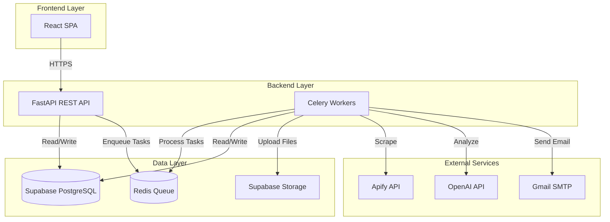
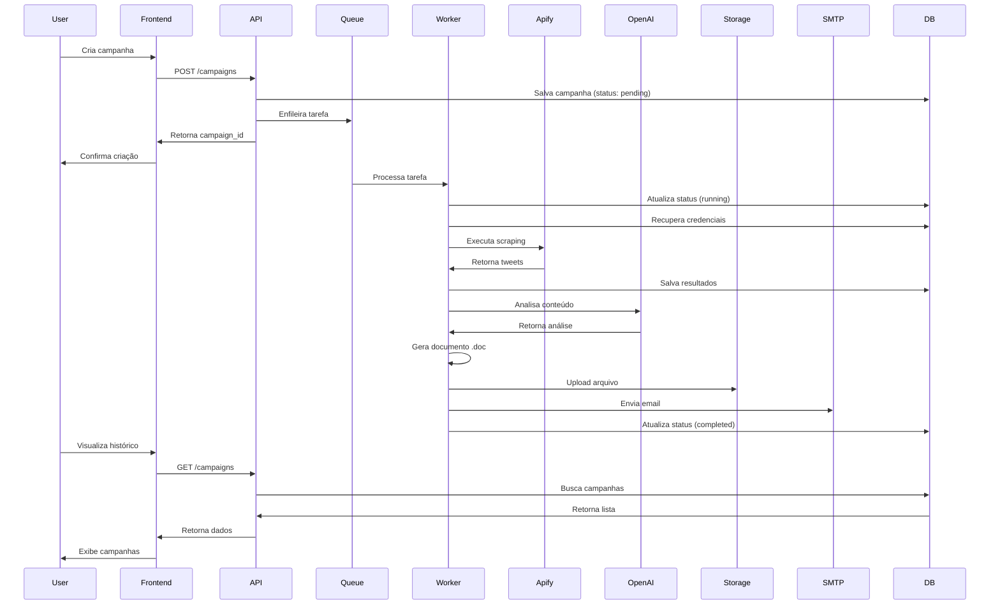
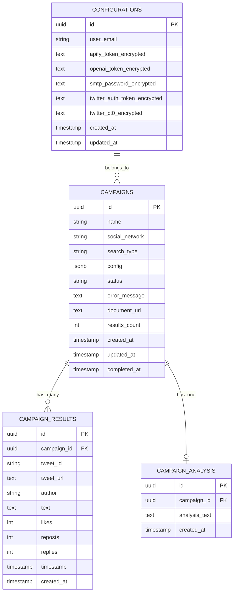
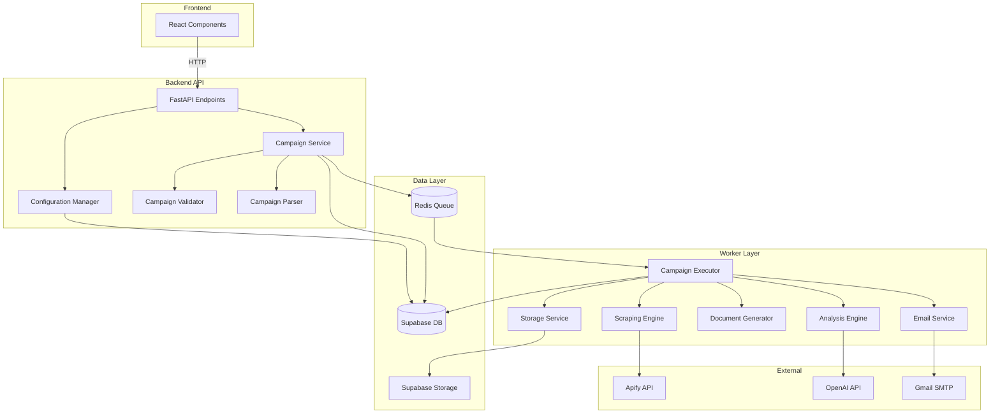
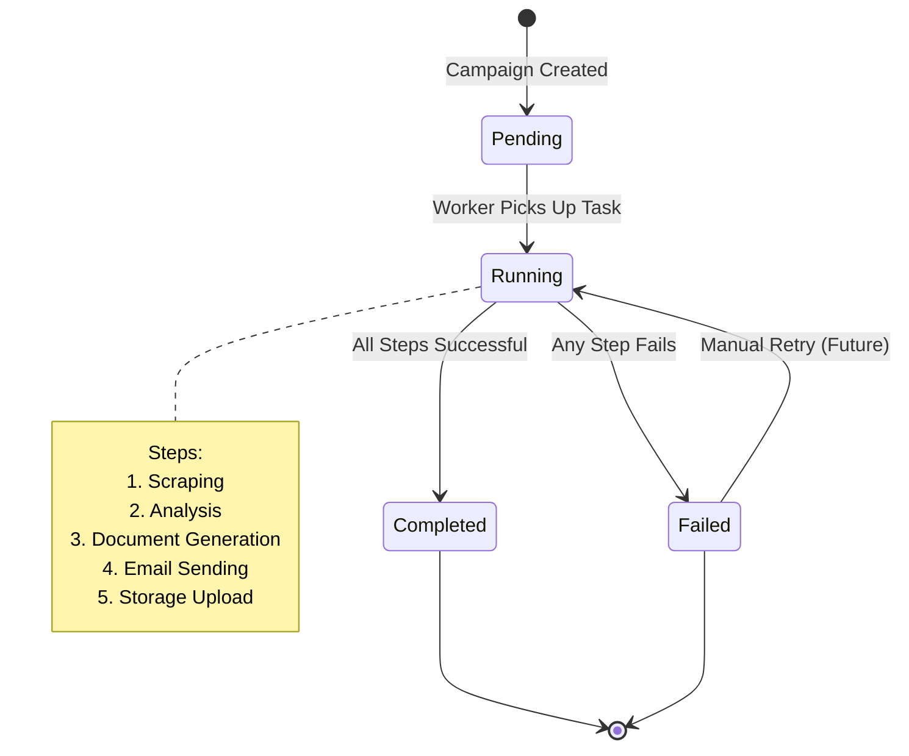

# Design Document: Twitter Scraping SaaS Platform

## Overview

A plataforma Twitter Scraping SaaS é um sistema web completo que permite aos usuários configurar, executar e gerenciar campanhas de scraping do Twitter de forma automatizada. O sistema migra a lógica existente dos agentes Node.js (twitter-monitoring-squad e twitter-outreach-squad) para uma arquitetura moderna baseada em Python (backend), React (frontend) e Supabase (banco de dados e storage).

### Principais Funcionalidades

- **Gerenciamento de Credenciais**: Armazenamento seguro de tokens de API (Apify, OpenAI) e configurações SMTP
- **Criação de Campanhas**: Interface intuitiva para configurar campanhas de scraping com filtros personalizados
- **Execução Assíncrona**: Processamento automático de campanhas em fila com feedback em tempo real
- **Scraping do Twitter**: Integração com Apify para coleta de tweets baseada em perfis ou keywords
- **Análise de Conteúdo**: Processamento de tweets coletados usando OpenAI API
- **Geração de Documentos**: Criação automática de arquivos .doc com resultados formatados
- **Notificação por Email**: Envio automático de resultados por email com anexos
- **Histórico e Visualização**: Interface para revisar campanhas anteriores e seus resultados

### Tecnologias Principais

- **Frontend**: React (SPA)
- **Backend**: Python com FastAPI
- **Banco de Dados**: Supabase PostgreSQL
- **Storage**: Supabase Storage
- **Fila**: Celery com Redis
- **Scraping**: Apify (automation-lab/twitter-scraper)
- **Análise**: OpenAI API
- **Email**: SMTP Gmail
- **Documentos**: python-docx

## Architecture

### Visão Geral da Arquitetura

O sistema segue uma arquitetura de três camadas com processamento assíncrono:



### Camadas do Sistema

#### 1. Frontend Layer (React SPA)

Interface de usuário responsiva que fornece:
- Páginas de configuração de credenciais
- Formulário de criação de campanhas
- Dashboard de histórico de campanhas
- Visualização detalhada de resultados
- Preview e download de documentos gerados

#### 2. Backend Layer (Python FastAPI)

Dividido em dois componentes principais:

**API Server (FastAPI)**:
- Endpoints REST para operações CRUD
- Validação de dados de entrada
- Autenticação e autorização (preparado para futuro)
- Gerenciamento de sessões
- Enfileiramento de tarefas assíncronas

**Worker Processes (Celery)**:
- Execução assíncrona de campanhas
- Orquestração de scraping, análise e geração de documentos
- Retry automático em caso de falhas
- Processamento paralelo de múltiplas campanhas

#### 3. Data Layer

**Supabase PostgreSQL**:
- Persistência de configurações do usuário
- Armazenamento de campanhas e status
- Registro de resultados de scraping
- Histórico de execuções

**Supabase Storage**:
- Armazenamento de arquivos .doc gerados
- URLs assinadas para download seguro

**Redis**:
- Fila de tarefas para Celery
- Cache de resultados (opcional)

#### 4. External Services

**Apify**: Execução de scraping do Twitter via actor automation-lab/twitter-scraper

**OpenAI**: Análise e processamento de conteúdo dos tweets coletados

**Gmail SMTP**: Envio de emails com resultados anexados

### Fluxo de Execução de Campanha



### Padrões Arquiteturais

#### Factory Pattern para Scraping Engines

Para suportar múltiplas redes sociais no futuro:

```python
class ScrapingEngine(ABC):
    @abstractmethod
    def scrape(self, config: dict) -> List[dict]:
        pass

class TwitterScrapingEngine(ScrapingEngine):
    def scrape(self, config: dict) -> List[dict]:
        # Implementação específica do Twitter
        pass

class ScrapingEngineFactory:
    @staticmethod
    def create(social_network: str) -> ScrapingEngine:
        if social_network == "twitter":
            return TwitterScrapingEngine()
        raise ValueError(f"Unsupported network: {social_network}")
```

#### Repository Pattern para Acesso a Dados

Abstração do acesso ao banco de dados:

```python
class CampaignRepository:
    def create(self, campaign: Campaign) -> Campaign:
        pass
    
    def get_by_id(self, campaign_id: str) -> Optional[Campaign]:
        pass
    
    def list_all(self, limit: int, offset: int) -> List[Campaign]:
        pass
    
    def update_status(self, campaign_id: str, status: str) -> None:
        pass
```

#### Service Layer para Lógica de Negócio

Separação de responsabilidades:

```python
class CampaignService:
    def __init__(self, repo: CampaignRepository, queue: QueueService):
        self.repo = repo
        self.queue = queue
    
    def create_campaign(self, data: dict) -> Campaign:
        # Validação
        # Transformação
        # Persistência
        # Enfileiramento
        pass
```

## Components and Interfaces

### Frontend Components

#### 1. ConfigurationPage

**Responsabilidade**: Gerenciar credenciais do usuário

**Props**: Nenhum

**State**:
- `email: string`
- `apifyToken: string`
- `openaiToken: string`
- `smtpPassword: string`
- `loading: boolean`
- `error: string | null`

**Métodos**:
- `loadConfiguration()`: Carrega configurações existentes
- `handleSubmit()`: Salva configurações
- `validateForm()`: Valida campos obrigatórios

**API Calls**:
- `GET /api/configuration`
- `POST /api/configuration`

#### 2. CampaignCreationPage

**Responsabilidade**: Criar novas campanhas de scraping

**Props**: Nenhum

**State**:
- `campaignName: string`
- `socialNetwork: string` (fixo: "twitter")
- `searchType: "profile" | "keywords"`
- `profiles: string`
- `keywords: string`
- `language: string`
- `minLikes: number`
- `minRetweets: number`
- `minReplies: number`
- `loading: boolean`
- `error: string | null`

**Métodos**:
- `handleSearchTypeChange()`: Alterna entre profile/keywords
- `handleSubmit()`: Cria campanha
- `validateForm()`: Valida campos obrigatórios
- `resetForm()`: Limpa formulário

**API Calls**:
- `POST /api/campaigns`

#### 3. CampaignHistoryPage

**Responsabilidade**: Listar campanhas executadas

**Props**: Nenhum

**State**:
- `campaigns: Campaign[]`
- `loading: boolean`
- `error: string | null`
- `page: number`
- `totalPages: number`

**Métodos**:
- `loadCampaigns()`: Carrega lista de campanhas
- `handlePageChange()`: Navega entre páginas
- `refreshStatus()`: Atualiza status das campanhas (polling)

**API Calls**:
- `GET /api/campaigns?page={page}&limit={limit}`

#### 4. CampaignDetailPage

**Responsabilidade**: Exibir detalhes e resultados de uma campanha

**Props**:
- `campaignId: string`

**State**:
- `campaign: Campaign | null`
- `results: Tweet[]`
- `loading: boolean`
- `error: string | null`

**Métodos**:
- `loadCampaignDetails()`: Carrega dados da campanha
- `handleDownloadDocument()`: Inicia download do .doc
- `handleViewDocument()`: Abre preview do documento

**API Calls**:
- `GET /api/campaigns/{id}`
- `GET /api/campaigns/{id}/download`

#### 5. DocumentViewer

**Responsabilidade**: Visualizar documentos .doc

**Props**:
- `documentUrl: string`
- `onClose: () => void`

**State**:
- `loading: boolean`
- `error: string | null`

**Métodos**:
- `loadDocument()`: Carrega conteúdo do documento

### Backend Components

#### 1. Configuration Manager

**Responsabilidade**: Gerenciar credenciais do usuário

**Classe**: `ConfigurationManager`

**Métodos**:
```python
class ConfigurationManager:
    def __init__(self, db: Database, encryptor: Encryptor):
        self.db = db
        self.encryptor = encryptor
    
    def save_configuration(self, config: ConfigurationDTO) -> None:
        """Salva credenciais criptografadas no banco"""
        pass
    
    def get_configuration(self) -> ConfigurationDTO:
        """Recupera credenciais descriptografadas"""
        pass
    
    def mask_tokens(self, config: ConfigurationDTO) -> ConfigurationDTO:
        """Retorna configuração com tokens mascarados"""
        pass
    
    def validate_tokens(self, config: ConfigurationDTO) -> bool:
        """Valida formato básico dos tokens"""
        pass
```

**Dependências**:
- `Database`: Acesso ao Supabase
- `Encryptor`: Criptografia AES-256

#### 2. Campaign Service

**Responsabilidade**: Orquestrar criação e gerenciamento de campanhas

**Classe**: `CampaignService`

**Métodos**:
```python
class CampaignService:
    def __init__(
        self,
        repo: CampaignRepository,
        queue: QueueService,
        validator: CampaignValidator
    ):
        self.repo = repo
        self.queue = queue
        self.validator = validator
    
    def create_campaign(self, data: CampaignCreateDTO) -> Campaign:
        """Valida, cria e enfileira campanha"""
        pass
    
    def get_campaign(self, campaign_id: str) -> Campaign:
        """Recupera campanha por ID"""
        pass
    
    def list_campaigns(self, page: int, limit: int) -> PaginatedResponse:
        """Lista campanhas com paginação"""
        pass
    
    def get_campaign_results(self, campaign_id: str) -> List[Tweet]:
        """Recupera resultados de uma campanha"""
        pass
```

**Dependências**:
- `CampaignRepository`: Acesso a dados
- `QueueService`: Enfileiramento de tarefas
- `CampaignValidator`: Validação de dados

#### 3. Campaign Executor

**Responsabilidade**: Executar campanhas de forma assíncrona

**Classe**: `CampaignExecutor` (Celery Task)

**Métodos**:
```python
@celery_app.task(bind=True, max_retries=3)
def execute_campaign(self, campaign_id: str):
    """
    Executa campanha completa:
    1. Atualiza status para 'running'
    2. Recupera credenciais
    3. Executa scraping
    4. Executa análise
    5. Gera documento
    6. Envia email
    7. Salva arquivo
    8. Atualiza status para 'completed'
    """
    pass
```

**Dependências**:
- `ScrapingEngine`: Execução de scraping
- `AnalysisEngine`: Análise de conteúdo
- `DocumentGenerator`: Geração de .doc
- `EmailService`: Envio de emails
- `StorageService`: Upload de arquivos
- `CampaignRepository`: Atualização de status

#### 4. Scraping Engine

**Responsabilidade**: Executar scraping do Twitter via Apify

**Classe**: `TwitterScrapingEngine`

**Métodos**:
```python
class TwitterScrapingEngine(ScrapingEngine):
    def __init__(self, apify_client: ApifyClient):
        self.client = apify_client
    
    def scrape(self, config: ScrapingConfig) -> List[Tweet]:
        """
        Executa scraping:
        1. Constrói query baseada em config
        2. Invoca Apify actor
        3. Aplica filtros locais
        4. Transforma resultados
        """
        pass
    
    def build_query(self, config: ScrapingConfig) -> str:
        """Constrói query do Twitter com operadores"""
        pass
    
    def apply_filters(self, tweets: List[dict], config: ScrapingConfig) -> List[dict]:
        """Aplica filtros de engajamento localmente"""
        pass
    
    def transform_results(self, raw_tweets: List[dict]) -> List[Tweet]:
        """Transforma dados do Apify em modelo interno"""
        pass
```

**Dependências**:
- `ApifyClient`: Cliente da API do Apify

#### 5. Analysis Engine

**Responsabilidade**: Analisar conteúdo com OpenAI

**Classe**: `AnalysisEngine`

**Métodos**:
```python
class AnalysisEngine:
    def __init__(self, openai_client: OpenAI):
        self.client = openai_client
    
    def analyze(self, tweets: List[Tweet]) -> Analysis:
        """
        Analisa tweets:
        1. Prepara prompt
        2. Invoca OpenAI API
        3. Processa resposta
        """
        pass
    
    def prepare_prompt(self, tweets: List[Tweet]) -> str:
        """Prepara prompt para OpenAI"""
        pass
    
    def parse_response(self, response: str) -> Analysis:
        """Parseia resposta da OpenAI"""
        pass
```

**Dependências**:
- `OpenAI`: Cliente da API da OpenAI

#### 6. Document Generator

**Responsabilidade**: Gerar arquivos .doc

**Classe**: `DocumentGenerator`

**Métodos**:
```python
class DocumentGenerator:
    def generate(
        self,
        campaign: Campaign,
        tweets: List[Tweet],
        analysis: Analysis
    ) -> str:
        """
        Gera documento .doc:
        1. Cria documento
        2. Adiciona cabeçalho
        3. Adiciona configuração
        4. Adiciona tweets
        5. Adiciona análise
        6. Salva arquivo
        7. Retorna caminho
        """
        pass
    
    def format_campaign_config(self, campaign: Campaign) -> str:
        """Formata configuração de forma legível"""
        pass
    
    def format_tweet(self, tweet: Tweet) -> str:
        """Formata tweet para documento"""
        pass
```

**Dependências**:
- `python-docx`: Biblioteca para geração de .doc

#### 7. Email Service

**Responsabilidade**: Enviar emails com anexos

**Classe**: `EmailService`

**Métodos**:
```python
class EmailService:
    def __init__(self, smtp_config: SMTPConfig):
        self.config = smtp_config
    
    def send_campaign_results(
        self,
        recipient: str,
        campaign: Campaign,
        document_path: str
    ) -> None:
        """
        Envia email:
        1. Cria mensagem
        2. Adiciona corpo
        3. Anexa documento
        4. Envia via SMTP
        """
        pass
    
    def create_message(
        self,
        recipient: str,
        campaign: Campaign
    ) -> EmailMessage:
        """Cria mensagem de email"""
        pass
```

**Dependências**:
- `smtplib`: Biblioteca SMTP do Python

#### 8. Storage Service

**Responsabilidade**: Gerenciar arquivos no Supabase Storage

**Classe**: `StorageService`

**Métodos**:
```python
class StorageService:
    def __init__(self, supabase_client: Client):
        self.client = supabase_client
    
    def upload_document(
        self,
        campaign_id: str,
        file_path: str
    ) -> str:
        """
        Upload de arquivo:
        1. Lê arquivo
        2. Upload para Supabase Storage
        3. Retorna URL pública
        """
        pass
    
    def get_signed_url(self, file_path: str, expires_in: int = 3600) -> str:
        """Gera URL assinada temporária"""
        pass
    
    def delete_document(self, file_path: str) -> None:
        """Remove arquivo do storage"""
        pass
```

**Dependências**:
- `supabase-py`: Cliente do Supabase

#### 9. Campaign Validator

**Responsabilidade**: Validar dados de campanha

**Classe**: `CampaignValidator`

**Métodos**:
```python
class CampaignValidator:
    def validate_create(self, data: CampaignCreateDTO) -> ValidationResult:
        """
        Valida criação de campanha:
        1. Nome não vazio
        2. Tipo de busca válido
        3. Perfis ou keywords presentes
        4. Filtros numéricos válidos
        """
        pass
    
    def validate_search_config(self, data: CampaignCreateDTO) -> ValidationResult:
        """Valida configuração de busca específica"""
        pass
```

#### 10. Campaign Parser

**Responsabilidade**: Parsear e formatar configurações

**Classe**: `CampaignParser`

**Métodos**:
```python
class CampaignParser:
    @staticmethod
    def parse_profiles(input: str) -> List[str]:
        """
        Parseia perfis:
        1. Split por vírgula ou quebra de linha
        2. Remove espaços
        3. Remove @
        4. Remove vazios
        """
        pass
    
    @staticmethod
    def parse_keywords(input: str) -> List[str]:
        """
        Parseia keywords:
        1. Split por vírgula ou quebra de linha
        2. Remove espaços
        3. Remove vazios
        """
        pass
    
    @staticmethod
    def format_profiles(profiles: List[str]) -> str:
        """Formata perfis com @ para exibição"""
        pass
    
    @staticmethod
    def format_keywords(keywords: List[str]) -> str:
        """Formata keywords para exibição"""
        pass
```

### API Endpoints

#### Configuration Endpoints

**GET /api/configuration**
- Descrição: Recupera configurações do usuário
- Autenticação: Não (MVP single-user)
- Response: `ConfigurationDTO` (com tokens mascarados)

**POST /api/configuration**
- Descrição: Salva configurações do usuário
- Autenticação: Não (MVP single-user)
- Body: `ConfigurationDTO`
- Response: `{ success: boolean }`

#### Campaign Endpoints

**POST /api/campaigns**
- Descrição: Cria nova campanha
- Autenticação: Não (MVP single-user)
- Body: `CampaignCreateDTO`
- Response: `{ campaign_id: string }`

**GET /api/campaigns**
- Descrição: Lista campanhas com paginação
- Autenticação: Não (MVP single-user)
- Query Params: `page: int`, `limit: int`
- Response: `PaginatedResponse<Campaign>`

**GET /api/campaigns/{id}**
- Descrição: Recupera detalhes de uma campanha
- Autenticação: Não (MVP single-user)
- Response: `CampaignDetailDTO`

**GET /api/campaigns/{id}/download**
- Descrição: Gera URL de download do documento
- Autenticação: Não (MVP single-user)
- Response: `{ download_url: string }`

## Data Models

### Database Schema (Supabase PostgreSQL)

#### Table: configurations

```sql
CREATE TABLE configurations (
    id UUID PRIMARY KEY DEFAULT uuid_generate_v4(),
    user_email VARCHAR(255) NOT NULL,
    apify_token_encrypted TEXT NOT NULL,
    openai_token_encrypted TEXT NOT NULL,
    smtp_password_encrypted TEXT NOT NULL,
    twitter_auth_token_encrypted TEXT,
    twitter_ct0_encrypted TEXT,
    created_at TIMESTAMP WITH TIME ZONE DEFAULT NOW(),
    updated_at TIMESTAMP WITH TIME ZONE DEFAULT NOW()
);

-- Índice para busca rápida (single-user no MVP, mas preparado para multi-user)
CREATE INDEX idx_configurations_user_email ON configurations(user_email);
```

#### Table: campaigns

```sql
CREATE TABLE campaigns (
    id UUID PRIMARY KEY DEFAULT uuid_generate_v4(),
    name VARCHAR(255) NOT NULL,
    social_network VARCHAR(50) NOT NULL DEFAULT 'twitter',
    search_type VARCHAR(20) NOT NULL CHECK (search_type IN ('profile', 'keywords')),
    config JSONB NOT NULL,
    status VARCHAR(20) NOT NULL CHECK (status IN ('pending', 'running', 'completed', 'failed')),
    error_message TEXT,
    document_url TEXT,
    results_count INTEGER DEFAULT 0,
    created_at TIMESTAMP WITH TIME ZONE DEFAULT NOW(),
    updated_at TIMESTAMP WITH TIME ZONE DEFAULT NOW(),
    completed_at TIMESTAMP WITH TIME ZONE
);

-- Índices para queries comuns
CREATE INDEX idx_campaigns_status ON campaigns(status);
CREATE INDEX idx_campaigns_created_at ON campaigns(created_at DESC);
CREATE INDEX idx_campaigns_social_network ON campaigns(social_network);
```

**config JSONB structure**:
```json
{
  "profiles": ["elonmusk", "naval"],
  "keywords": ["AI", "machine learning"],
  "language": "en",
  "min_likes": 10,
  "min_retweets": 5,
  "min_replies": 2,
  "hours_back": 24
}
```

#### Table: campaign_results

```sql
CREATE TABLE campaign_results (
    id UUID PRIMARY KEY DEFAULT uuid_generate_v4(),
    campaign_id UUID NOT NULL REFERENCES campaigns(id) ON DELETE CASCADE,
    tweet_id VARCHAR(255) NOT NULL,
    tweet_url TEXT NOT NULL,
    author VARCHAR(255) NOT NULL,
    text TEXT NOT NULL,
    likes INTEGER DEFAULT 0,
    reposts INTEGER DEFAULT 0,
    replies INTEGER DEFAULT 0,
    timestamp TIMESTAMP WITH TIME ZONE NOT NULL,
    created_at TIMESTAMP WITH TIME ZONE DEFAULT NOW()
);

-- Índices para queries comuns
CREATE INDEX idx_campaign_results_campaign_id ON campaign_results(campaign_id);
CREATE INDEX idx_campaign_results_tweet_id ON campaign_results(tweet_id);
CREATE INDEX idx_campaign_results_timestamp ON campaign_results(timestamp DESC);

-- Índice composto para busca de resultados de uma campanha ordenados por timestamp
CREATE INDEX idx_campaign_results_campaign_timestamp ON campaign_results(campaign_id, timestamp DESC);
```

#### Table: campaign_analysis

```sql
CREATE TABLE campaign_analysis (
    id UUID PRIMARY KEY DEFAULT uuid_generate_v4(),
    campaign_id UUID NOT NULL REFERENCES campaigns(id) ON DELETE CASCADE,
    analysis_text TEXT NOT NULL,
    created_at TIMESTAMP WITH TIME ZONE DEFAULT NOW()
);

-- Índice para busca rápida
CREATE INDEX idx_campaign_analysis_campaign_id ON campaign_analysis(campaign_id);
```

### Python Data Models

#### ConfigurationDTO

```python
from pydantic import BaseModel, EmailStr
from typing import Optional

class ConfigurationDTO(BaseModel):
    user_email: EmailStr
    apify_token: str
    openai_token: str
    smtp_password: str
    twitter_auth_token: Optional[str] = None
    twitter_ct0: Optional[str] = None

class ConfigurationResponseDTO(BaseModel):
    user_email: EmailStr
    apify_token_masked: str  # "apify_XXX...XXX"
    openai_token_masked: str  # "sk-XXX...XXX"
    smtp_password_masked: str  # "***"
    twitter_auth_token_present: bool
    twitter_ct0_present: bool
```

#### CampaignCreateDTO

```python
from pydantic import BaseModel, validator
from typing import Optional, List
from enum import Enum

class SearchType(str, Enum):
    PROFILE = "profile"
    KEYWORDS = "keywords"

class CampaignCreateDTO(BaseModel):
    name: str
    social_network: str = "twitter"
    search_type: SearchType
    profiles: Optional[str] = None  # Comma or newline separated
    keywords: Optional[str] = None  # Comma or newline separated
    language: str = "en"
    min_likes: int = 0
    min_retweets: int = 0
    min_replies: int = 0
    hours_back: int = 24
    
    @validator('name')
    def name_not_empty(cls, v):
        if not v or not v.strip():
            raise ValueError('Campaign name cannot be empty')
        return v.strip()
    
    @validator('profiles')
    def validate_profiles(cls, v, values):
        if values.get('search_type') == SearchType.PROFILE:
            if not v or not v.strip():
                raise ValueError('Profiles required for profile search')
        return v
    
    @validator('keywords')
    def validate_keywords(cls, v, values):
        if values.get('search_type') == SearchType.KEYWORDS:
            if not v or not v.strip():
                raise ValueError('Keywords required for keyword search')
        return v
```

#### Campaign

```python
from pydantic import BaseModel
from datetime import datetime
from typing import Optional
from uuid import UUID

class CampaignConfig(BaseModel):
    profiles: Optional[List[str]] = None
    keywords: Optional[List[str]] = None
    language: str
    min_likes: int
    min_retweets: int
    min_replies: int
    hours_back: int

class Campaign(BaseModel):
    id: UUID
    name: str
    social_network: str
    search_type: str
    config: CampaignConfig
    status: str
    error_message: Optional[str] = None
    document_url: Optional[str] = None
    results_count: int
    created_at: datetime
    updated_at: datetime
    completed_at: Optional[datetime] = None
```

#### Tweet

```python
from pydantic import BaseModel
from datetime import datetime

class Tweet(BaseModel):
    id: str
    url: str
    author: str
    text: str
    likes: int
    reposts: int
    replies: int
    timestamp: datetime
```

#### Analysis

```python
from pydantic import BaseModel

class Analysis(BaseModel):
    summary: str
    key_themes: List[str]
    sentiment: str
    top_influencers: List[str]
    recommendations: List[str]
```

#### PaginatedResponse

```python
from pydantic import BaseModel
from typing import Generic, TypeVar, List

T = TypeVar('T')

class PaginatedResponse(BaseModel, Generic[T]):
    items: List[T]
    total: int
    page: int
    limit: int
    total_pages: int
```

### Supabase Storage Structure

```
campaigns/
├── {campaign_id}/
│   └── results.doc
```

## Correctness Properties

*A property is a characteristic or behavior that should hold true across all valid executions of a system-essentially, a formal statement about what the system should do. Properties serve as the bridge between human-readable specifications and machine-verifiable correctness guarantees.*


### Property Reflection

Após análise inicial, identifiquei as seguintes redundâncias e oportunidades de consolidação:

**Redundâncias Identificadas:**

1. **Parsing de Perfis e Keywords**: As propriedades 20.1, 20.2, 20.3, 20.4 testam parsing por vírgula e quebra de linha para perfis e keywords. Estas podem ser consolidadas em uma única propriedade genérica de parsing que aceita ambos os delimitadores.

2. **Remoção de @ e Preservação de Keywords**: As propriedades 3.4 e 20.7 testam remoção de @, e 3.5 e 20.8 testam preservação de keywords. Estas são duplicatas e podem ser consolidadas.

3. **Mascaramento de Tokens**: As propriedades 1.4, 16.3 e 16.4 todas testam que tokens não são expostos completamente. Estas podem ser consolidadas em uma única propriedade de mascaramento.

4. **Validação de Campos Obrigatórios**: As propriedades 1.2 e 2.12 testam validação de campos obrigatórios em contextos diferentes (configuração vs campanha), mas o princípio é o mesmo. Manteremos separadas pois validam estruturas diferentes.

5. **Query Construction**: As propriedades 5.2-5.8 testam construção de query. Estas podem ser parcialmente consolidadas em propriedades que testam a query completa ao invés de operadores individuais.

**Propriedades Consolidadas:**

- **Parsing Genérico**: Uma propriedade que testa parsing de listas com múltiplos delimitadores (vírgula, quebra de linha)
- **Transformação de Perfis**: Uma propriedade que testa remoção de @ e trimming
- **Preservação de Keywords**: Uma propriedade que testa que keywords são preservadas (exceto trimming)
- **Mascaramento de Tokens**: Uma propriedade que testa que tokens nunca são expostos completamente
- **Query Construction Completa**: Propriedades que testam a query final ao invés de operadores individuais

### Property 1: Configuration Round-Trip Preserves Data

*For any* valid configuration with email and API tokens, storing the configuration in the database and then retrieving it SHALL produce a configuration with equivalent values (tokens may be encrypted in storage but must decrypt to original values).

**Validates: Requirements 1.3, 1.5, 1.7**

### Property 2: Token Masking Never Exposes Complete Tokens

*For any* API token string, the masking function SHALL return a string that is different from the input and follows the pattern of showing only first and last few characters (e.g., "apify_XXX...XXX").

**Validates: Requirements 1.4, 16.3, 16.4**

### Property 3: Configuration Validation Rejects Incomplete Data

*For any* configuration object, if any required field (email, apify_token, openai_token, smtp_password) is missing or empty, validation SHALL fail with a descriptive error message.

**Validates: Requirements 1.2**

### Property 4: Campaign Name Validation Rejects Empty Names

*For any* campaign creation request, if the campaign name is empty or contains only whitespace, validation SHALL fail.

**Validates: Requirements 3.1**

### Property 5: Profile Search Requires Profiles

*For any* campaign creation request with search_type "profile", if no profiles are provided or the profiles string is empty after parsing, validation SHALL fail.

**Validates: Requirements 3.2**

### Property 6: Keyword Search Requires Keywords

*For any* campaign creation request with search_type "keywords", if no keywords are provided or the keywords string is empty after parsing, validation SHALL fail.

**Validates: Requirements 3.3**

### Property 7: Profile Parsing Removes @ Symbol

*For any* profile string (with or without @ prefix), parsing SHALL remove the @ symbol and return the username only.

**Validates: Requirements 3.4, 20.7**

### Property 8: Keyword Preservation

*For any* keyword string, parsing SHALL preserve the exact text (after trimming whitespace) without modification or expansion.

**Validates: Requirements 3.5, 20.8**

### Property 9: Engagement Filters Must Be Non-Negative

*For any* campaign configuration, if any engagement filter (min_likes, min_retweets, min_replies) is negative, validation SHALL fail.

**Validates: Requirements 3.6**

### Property 10: List Parsing Handles Multiple Delimiters

*For any* string containing items separated by commas or newlines, parsing SHALL correctly split into individual items, trim whitespace from each item, and remove empty items.

**Validates: Requirements 20.1, 20.2, 20.3, 20.4, 20.5, 20.6**

### Property 11: Parsed List Is Never Empty After Valid Input

*For any* non-empty input string containing at least one non-whitespace character, parsing SHALL produce a non-empty list.

**Validates: Requirements 20.9**

### Property 12: Profile Query Construction

*For any* list of profiles, the scraping engine SHALL construct a query where each profile appears with the "from:" operator, and multiple profiles are combined with "OR".

**Validates: Requirements 5.2, 5.3**

### Property 13: Keyword Query Construction

*For any* list of keywords, the scraping engine SHALL construct a query where keywords are combined with "OR" operator.

**Validates: Requirements 5.4**

### Property 14: Language Operator Always Present

*For any* scraping configuration with a language specified, the constructed query SHALL contain the "lang:" operator with that language.

**Validates: Requirements 5.5**

### Property 15: Conditional Min Faves Operator

*For any* scraping configuration, the "min_faves:" operator SHALL be present in the query if and only if min_likes > 0.

**Validates: Requirements 5.6**

### Property 16: Conditional Min Replies Operator

*For any* scraping configuration, the "min_replies:" operator SHALL be present in the query if and only if min_replies > 0.

**Validates: Requirements 5.7**

### Property 17: Since Operator Date Calculation

*For any* scraping configuration with hours_back specified, the "since:" operator SHALL contain a date that is exactly hours_back hours before the current time.

**Validates: Requirements 5.8**

### Property 18: Local Filtering Enforces Engagement Criteria

*For any* list of tweets and engagement criteria (min_likes, min_retweets, min_replies), filtering SHALL remove all tweets that do not meet ALL specified criteria.

**Validates: Requirements 5.11**

### Property 19: Tweet Transformation Includes All Required Fields

*For any* raw tweet data from Apify, the transformed tweet SHALL contain all required fields: id, url, author, text, likes, reposts, replies, timestamp.

**Validates: Requirements 5.12**

### Property 20: Document Contains All Required Sections

*For any* campaign with tweets and analysis, the generated document SHALL contain sections for: campaign name, execution date, configuration parameters, collected tweets, and analysis results.

**Validates: Requirements 7.3, 7.4**

### Property 21: Configuration Formatting Is Reversible

*For any* valid campaign configuration, parsing the configuration, formatting it for display, and parsing again SHALL produce an equivalent configuration.

**Validates: Requirements 22.1**

### Property 22: Token Encryption Is Reversible

*For any* API token, encrypting the token and then decrypting it SHALL produce the original token value.

**Validates: Requirements 16.1**

### Property 23: FIFO Queue Processing Order

*For any* sequence of campaigns enqueued, the processing order SHALL match the enqueue order (first in, first out).

**Validates: Requirements 4.2**

### Property 24: Campaign Status Transitions Are Valid

*For any* campaign, status transitions SHALL follow the valid state machine: pending → running → (completed | failed). No other transitions are allowed.

**Validates: Requirements 4.3, 4.7, 4.12**

## Error Handling

### Error Categories

#### 1. Validation Errors (HTTP 400)

**Trigger**: Invalid input data from user

**Handling**:
- Return HTTP 400 Bad Request
- Include specific error message for each invalid field
- Log validation failure with input data (excluding sensitive tokens)
- Do not create campaign or modify database

**Examples**:
- Empty campaign name
- Missing profiles for profile search
- Negative engagement filters
- Invalid email format

#### 2. Configuration Errors (HTTP 400)

**Trigger**: Missing or invalid user configuration

**Handling**:
- Return HTTP 400 Bad Request with message "Configuration not found. Please configure API tokens first."
- Redirect user to configuration page
- Log configuration check failure

**Examples**:
- No configuration saved
- Missing required tokens
- Invalid token format

#### 3. External Service Errors (HTTP 502)

**Trigger**: Failure in external API calls (Apify, OpenAI, SMTP)

**Handling**:
- Mark campaign as "failed" in database
- Store detailed error message including service name and error code
- Retry up to 3 times with exponential backoff for transient errors
- Log full error details including stack trace
- Do not send email notification for failed campaigns

**Examples**:
- Apify API timeout
- OpenAI rate limit exceeded
- SMTP authentication failure
- Invalid Twitter cookies

#### 4. Database Errors (HTTP 500)

**Trigger**: Database connection or query failures

**Handling**:
- Return HTTP 500 Internal Server Error
- Log full error with stack trace
- Do not expose database details to user
- Implement connection retry logic
- Use database transactions for multi-step operations

**Examples**:
- Connection timeout
- Constraint violation
- Query syntax error

#### 5. Storage Errors (HTTP 500)

**Trigger**: File upload or retrieval failures

**Handling**:
- Mark campaign as "failed" if upload fails during execution
- Log error with file details
- Retry upload up to 3 times
- Return HTTP 404 if file not found during download
- Generate new signed URL if expired

**Examples**:
- Upload timeout
- Storage quota exceeded
- File not found
- Invalid file path

### Error Response Format

All error responses follow consistent JSON structure:

```json
{
  "error": {
    "code": "VALIDATION_ERROR",
    "message": "Campaign name cannot be empty",
    "details": {
      "field": "name",
      "value": "",
      "constraint": "non_empty"
    }
  }
}
```

### Error Logging Strategy

**Log Levels**:
- **ERROR**: External service failures, database errors, unexpected exceptions
- **WARNING**: Validation failures, configuration issues, retry attempts
- **INFO**: Campaign status changes, successful operations
- **DEBUG**: Detailed execution flow, query construction, data transformations

**Log Format**:
```
[TIMESTAMP] [LEVEL] [COMPONENT] [CAMPAIGN_ID] Message
```

**Sensitive Data Handling**:
- Never log complete API tokens (use masked versions)
- Never log passwords or encryption keys
- Never log complete Twitter cookies
- Sanitize user input before logging

### Retry Strategy

**Transient Errors** (network timeouts, rate limits):
- Retry up to 3 times
- Exponential backoff: 1s, 2s, 4s
- Log each retry attempt

**Permanent Errors** (authentication failures, invalid input):
- Do not retry
- Mark campaign as failed immediately
- Log error details

### Circuit Breaker Pattern

For external services (Apify, OpenAI):
- Track failure rate over sliding window (last 10 requests)
- Open circuit if failure rate > 50%
- Half-open after 60 seconds to test recovery
- Close circuit after 3 consecutive successes

## Testing Strategy

### Testing Approach

A plataforma utilizará uma estratégia de testes em múltiplas camadas:

1. **Property-Based Tests**: Para validar propriedades universais de parsing, validação, transformação e round-trip
2. **Unit Tests**: Para testar componentes individuais com exemplos específicos
3. **Integration Tests**: Para testar integração com serviços externos (Apify, OpenAI, Supabase, SMTP)
4. **End-to-End Tests**: Para validar fluxos completos de usuário

### Property-Based Testing

**Framework**: Hypothesis (Python)

**Configuration**:
- Minimum 100 iterations per property test
- Seed for reproducibility
- Shrinking enabled for minimal failing examples

**Test Organization**:
```
tests/
├── properties/
│   ├── test_configuration_properties.py
│   ├── test_campaign_validation_properties.py
│   ├── test_parsing_properties.py
│   ├── test_query_construction_properties.py
│   ├── test_transformation_properties.py
│   └── test_roundtrip_properties.py
```

**Property Test Example**:
```python
from hypothesis import given, strategies as st
import pytest

@given(st.text(min_size=1))
def test_token_masking_never_exposes_complete_token(token):
    """
    Feature: twitter-scraping-saas-platform
    Property 2: Token Masking Never Exposes Complete Tokens
    
    For any API token string, the masking function SHALL return
    a string that is different from the input.
    """
    masked = mask_token(token)
    assert masked != token
    assert "XXX" in masked or "***" in masked
```

**Generators (Strategies)**:

```python
# Configuration generators
@st.composite
def valid_configuration(draw):
    return ConfigurationDTO(
        user_email=draw(st.emails()),
        apify_token=draw(st.text(min_size=20, max_size=50)),
        openai_token=draw(st.text(min_size=20, max_size=50)),
        smtp_password=draw(st.text(min_size=8, max_size=30))
    )

# Campaign generators
@st.composite
def valid_campaign(draw):
    search_type = draw(st.sampled_from(["profile", "keywords"]))
    return CampaignCreateDTO(
        name=draw(st.text(min_size=1, max_size=100)),
        search_type=search_type,
        profiles=draw(st.text()) if search_type == "profile" else None,
        keywords=draw(st.text()) if search_type == "keywords" else None,
        language=draw(st.sampled_from(["en", "pt", "es"])),
        min_likes=draw(st.integers(min_value=0, max_value=1000)),
        min_retweets=draw(st.integers(min_value=0, max_value=1000)),
        min_replies=draw(st.integers(min_value=0, max_value=1000)),
        hours_back=draw(st.integers(min_value=1, max_value=168))
    )

# Profile/keyword list generators
@st.composite
def profile_list(draw):
    profiles = draw(st.lists(
        st.text(alphabet=st.characters(whitelist_categories=('Lu', 'Ll', 'Nd')), 
                min_size=1, max_size=20),
        min_size=1,
        max_size=10
    ))
    # Randomly add @ prefix
    return [f"@{p}" if draw(st.booleans()) else p for p in profiles]

@st.composite
def delimited_string(draw, items):
    delimiter = draw(st.sampled_from([",", "\n", ", "]))
    return delimiter.join(items)
```

### Unit Testing

**Framework**: pytest

**Coverage Target**: > 80% code coverage

**Focus Areas**:
- Individual validation functions
- Parsing logic
- Query construction
- Data transformation
- Error handling
- Masking and encryption

**Test Organization**:
```
tests/
├── unit/
│   ├── test_configuration_manager.py
│   ├── test_campaign_service.py
│   ├── test_campaign_validator.py
│   ├── test_campaign_parser.py
│   ├── test_scraping_engine.py
│   ├── test_analysis_engine.py
│   ├── test_document_generator.py
│   ├── test_email_service.py
│   └── test_storage_service.py
```

**Unit Test Example**:
```python
def test_empty_campaign_name_validation():
    """Test that empty campaign name is rejected"""
    validator = CampaignValidator()
    data = CampaignCreateDTO(
        name="",
        search_type="keywords",
        keywords="test"
    )
    result = validator.validate_create(data)
    assert not result.is_valid
    assert "name" in result.errors

def test_profile_parsing_removes_at_symbol():
    """Test that @ symbol is removed from profiles"""
    profiles = CampaignParser.parse_profiles("@user1, @user2, user3")
    assert profiles == ["user1", "user2", "user3"]
```

### Integration Testing

**Framework**: pytest with mocking (pytest-mock, responses)

**Focus Areas**:
- Apify API integration
- OpenAI API integration
- Supabase database operations
- Supabase Storage operations
- SMTP email sending
- Celery task execution

**Test Organization**:
```
tests/
├── integration/
│   ├── test_apify_integration.py
│   ├── test_openai_integration.py
│   ├── test_supabase_integration.py
│   ├── test_storage_integration.py
│   ├── test_email_integration.py
│   └── test_queue_integration.py
```

**Integration Test Example**:
```python
@pytest.fixture
def mock_apify_client(mocker):
    """Mock Apify client for testing"""
    mock_client = mocker.Mock()
    mock_run = mocker.Mock()
    mock_run.defaultDatasetId = "test-dataset-id"
    mock_client.actor.return_value.call.return_value = mock_run
    return mock_client

def test_scraping_engine_calls_apify_with_correct_query(mock_apify_client):
    """Test that scraping engine constructs and sends correct query"""
    engine = TwitterScrapingEngine(mock_apify_client)
    config = ScrapingConfig(
        search_type="keywords",
        keywords=["AI", "ML"],
        language="en",
        min_likes=10
    )
    
    engine.scrape(config)
    
    # Verify Apify was called with correct parameters
    call_args = mock_apify_client.actor.return_value.call.call_args
    assert '"AI" OR "ML"' in call_args[0][0]['searchTerms'][0]
    assert 'lang:en' in call_args[0][0]['searchTerms'][0]
    assert 'min_faves:10' in call_args[0][0]['searchTerms'][0]
```

### End-to-End Testing

**Framework**: Playwright (for frontend) + pytest (for API)

**Focus Areas**:
- Complete user workflows
- Frontend-backend integration
- Real database operations (test database)
- File upload and download
- Email delivery (test SMTP)

**Test Scenarios**:
1. User configures credentials → creates campaign → views results
2. User creates campaign with invalid data → sees error messages
3. Campaign execution fails → user sees error in history
4. User downloads document → file is correct
5. Multiple campaigns execute in parallel → all complete successfully

**Test Organization**:
```
tests/
├── e2e/
│   ├── test_configuration_flow.py
│   ├── test_campaign_creation_flow.py
│   ├── test_campaign_execution_flow.py
│   └── test_history_and_download_flow.py
```

### Test Data Management

**Fixtures**:
- Sample configurations
- Sample campaigns
- Sample tweets
- Sample Apify responses
- Sample OpenAI responses

**Database**:
- Use separate test database
- Reset database before each test
- Use transactions for test isolation

**External Services**:
- Mock by default
- Use real services only in CI/CD for smoke tests
- Use VCR.py for recording/replaying HTTP interactions

### Continuous Integration

**CI Pipeline**:
1. Lint (flake8, black, mypy)
2. Unit tests (fast, run on every commit)
3. Property-based tests (run on every commit)
4. Integration tests (run on every commit, with mocks)
5. E2E tests (run on PR, with test database)
6. Coverage report (fail if < 80%)

**Test Execution Time Targets**:
- Unit tests: < 30 seconds
- Property tests: < 2 minutes
- Integration tests: < 1 minute
- E2E tests: < 5 minutes

### Property-Based Test Tags

Each property-based test MUST include a comment tag referencing the design property:

```python
@given(valid_configuration())
def test_configuration_roundtrip(config):
    """
    Feature: twitter-scraping-saas-platform
    Property 1: Configuration Round-Trip Preserves Data
    
    For any valid configuration with email and API tokens,
    storing and retrieving SHALL produce equivalent values.
    """
    # Test implementation
    pass
```

## Implementation Notes

### Technology Stack Details

**Backend**:
- Python 3.11+
- FastAPI 0.104+
- Celery 5.3+
- Redis 5.0+
- Supabase-py 2.0+
- python-docx 1.0+
- Hypothesis 6.92+ (testing)
- pytest 7.4+ (testing)

**Frontend**:
- React 18+
- TypeScript 5+
- Vite (build tool)
- React Router (routing)
- Axios (HTTP client)
- TanStack Query (data fetching)
- Tailwind CSS (styling)

**Infrastructure**:
- Supabase (PostgreSQL + Storage)
- Redis (queue)
- Docker (containerization)
- Docker Compose (local development)

### Security Considerations

**Encryption**:
- Use AES-256-GCM for token encryption
- Store encryption key in environment variable
- Rotate encryption key periodically
- Use unique IV for each encryption operation

**HTTPS**:
- Enforce HTTPS in production
- Use TLS 1.3
- Implement HSTS headers

**Input Validation**:
- Validate all user input on backend
- Sanitize input before database queries
- Use parameterized queries (Supabase handles this)
- Implement rate limiting on API endpoints

**Token Storage**:
- Never log complete tokens
- Never return complete tokens in API responses
- Use secure random for token generation
- Implement token rotation mechanism (future)

### Performance Considerations

**Database**:
- Use connection pooling (max 20 connections)
- Implement database indexes on frequently queried columns
- Use JSONB for flexible campaign config storage
- Implement pagination for large result sets

**Queue**:
- Use Redis for fast queue operations
- Implement worker autoscaling based on queue length
- Set task timeout to prevent hanging workers
- Use task result backend for status tracking

**Caching**:
- Cache configuration data (TTL: 5 minutes)
- Cache campaign list (TTL: 10 seconds)
- Invalidate cache on updates

**File Storage**:
- Use Supabase Storage CDN for file delivery
- Generate signed URLs with short expiration (1 hour)
- Implement file size limits (max 10MB per document)
- Clean up old files periodically (retention: 90 days)

### Deployment Strategy

**Environments**:
- Development (local Docker Compose)
- Staging (cloud deployment)
- Production (cloud deployment)

**Deployment Steps**:
1. Run all tests in CI/CD
2. Build Docker images
3. Push images to registry
4. Deploy backend API
5. Deploy Celery workers
6. Deploy frontend (static files to CDN)
7. Run database migrations
8. Smoke test critical paths

**Monitoring**:
- Application logs (structured JSON)
- Error tracking (Sentry or similar)
- Performance monitoring (APM)
- Queue monitoring (Celery Flower)
- Database monitoring (Supabase dashboard)

### Future Enhancements

**Multi-User Support**:
- Implement authentication (JWT)
- Add user registration and login
- Implement user-specific data isolation
- Add role-based access control

**Additional Social Networks**:
- LinkedIn scraping
- Instagram scraping
- Facebook scraping
- Implement network-specific scraping engines

**Advanced Features**:
- Scheduled campaigns (cron-like)
- Campaign templates
- Custom analysis prompts
- Export to multiple formats (PDF, CSV, JSON)
- Real-time campaign progress updates (WebSocket)
- Campaign sharing and collaboration

**Analytics**:
- Campaign performance metrics
- Usage statistics dashboard
- Cost tracking (API usage)
- Trend analysis over time

## Diagrams

### Entity Relationship Diagram



### Component Interaction Diagram



### State Machine Diagram



## Conclusion

Este documento de design define a arquitetura completa da plataforma Twitter Scraping SaaS, incluindo:

- **Arquitetura em três camadas** com processamento assíncrono via Celery
- **Componentes bem definidos** com responsabilidades claras e interfaces documentadas
- **Modelos de dados** estruturados para Supabase PostgreSQL
- **24 propriedades de correção** testáveis via property-based testing
- **Estratégia de testes abrangente** com unit, integration e E2E tests
- **Tratamento de erros robusto** com retry logic e circuit breaker
- **Considerações de segurança** incluindo criptografia de tokens e validação de entrada
- **Estrutura preparada para expansão** com suporte futuro para múltiplas redes sociais

A implementação seguirá os padrões definidos neste documento, garantindo um sistema confiável, testável e manutenível.
